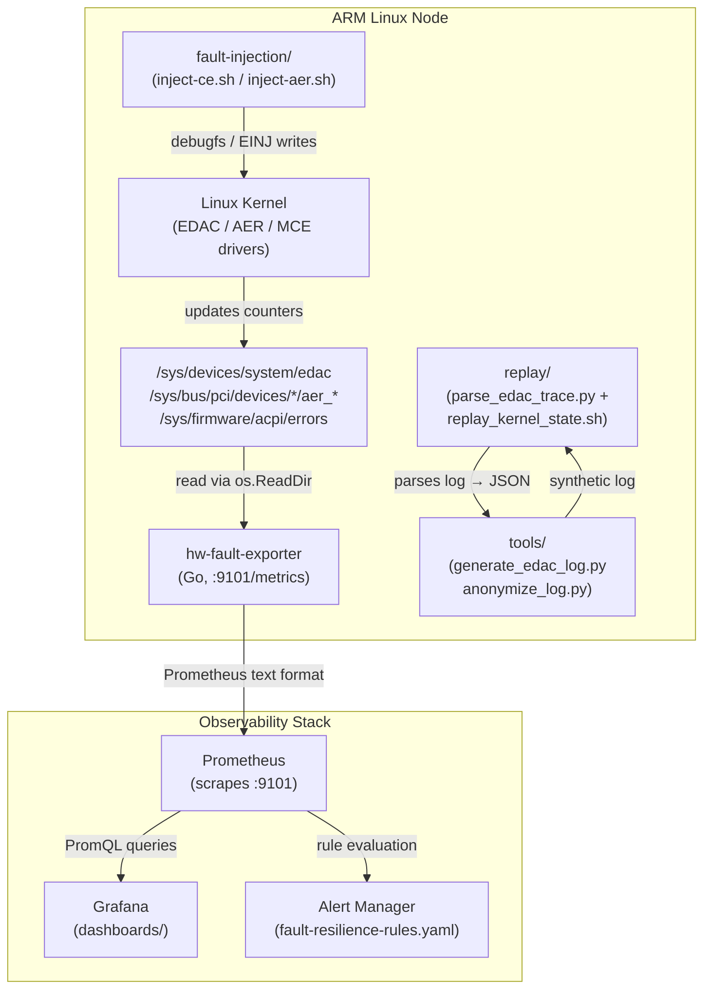
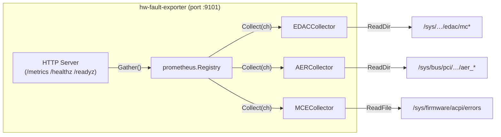
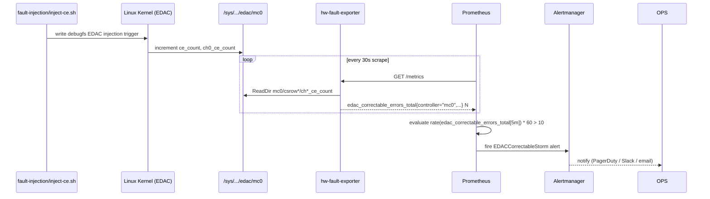

<!-- SPDX-License-Identifier: Apache-2.0 -->
# Architecture

This document describes the system architecture of `arm-linux-fault-resilience`.

---

## System Context

The following diagram shows how the components interact at runtime on a
deployed ARM Linux node.



---

## Component Breakdown

### hw-fault-exporter (Go)

A multi-collector Prometheus exporter that scrapes hardware fault counters
from Linux sysfs. Designed for minimal overhead: reads are done synchronously
on each `/metrics` scrape, no background polling.



Collector health is exposed as `fault_resilience_collector_up{collector="..."}`:
- **1** — sysfs path accessible, metrics are live
- **0** — subsystem absent (module not loaded, platform lacks support)

### Fault Injection

Shell scripts that write to the kernel's `debugfs` EDAC injection interface
or ACPI EINJ. All scripts accept `--dry-run` for safe CI execution:

| Script | Target | Backend |
|--------|--------|---------|
| `inject-ce.sh` | EDAC correctable error | debugfs |
| `inject-ue.sh` | EDAC uncorrectable error | debugfs |
| `inject-aer.sh` | PCIe AER error | debugfs / EINJ |

### Replay Toolkit

A two-stage pipeline for post-mortem analysis:

1. **parse_edac_trace.py** — extracts EDAC/AER/MCE events from kernel logs → JSON
2. **replay_kernel_state.sh** — injects the parsed events back into the running kernel at a configurable speed multiplier

### Deploy

| Path | Purpose |
|------|---------|
| `deploy/k8s/` | Raw Kubernetes manifests (DaemonSet, Service, ServiceMonitor) |
| `deploy/helm/` | Helm chart for parameterised deployment |
| `deploy/alerts/` | Prometheus alerting and recording rules |
| `deploy/prometheus/` | Prometheus scrape config snippets |
| `dashboards/` | Grafana dashboard JSON |

---

## CE Storm Detection Flow

The following sequence shows how a correctable error storm is detected
from injection to alert:



---

## Data Flow: Log Analysis

```
   ┌─────────────────────┐
   │  /var/log/kern.log  │   or   │  dmesg output  │
   │  (journald export)  │        │  (live system)  │
   └─────────┬───────────┘        └────────┬────────┘
             │                             │
             ▼                             ▼
   ┌──────────────────────────────────────────────────┐
   │           parse_edac_trace.py                    │
   │   • extracts EDAC CE/UE, AER CE/UE, MCE events   │
   │   • structured output: JSON array of HardwareEvent│
   └──────────────────────┬───────────────────────────┘
                          │
              ┌───────────┴──────────┐
              ▼                      ▼
   ┌────────────────────┐  ┌─────────────────────────┐
   │ replay_kernel_     │  │  Post-mortem analysis   │
   │ state.sh           │  │  (jq, Jupyter, pandas)  │
   │ (re-inject events  │  └─────────────────────────┘
   │  at N× speed)      │
   └────────────────────┘
```

---

## Security Boundaries

- The exporter runs as UID 65532 (`nonroot`) inside a distroless container.
- It requires **read-only** access to `/sys` — mounted as a `hostPath` volume with `readOnly: true`.
- No network egress beyond the metrics port (9101). No Kubernetes API access.
- Fault injection scripts require **root** or `CAP_SYS_RAWIO`. They must not run in the exporter container.
- Secret scanning (gitleaks) and CVE scanning (trivy, grype) run in CI on every push.

---

## Testing Strategy

| Layer | Tool | Coverage target |
|-------|------|----------------|
| Go unit tests | `go test -race ./...` | ≥80% (collector logic) |
| Python unit tests | `pytest` + hypothesis | ≥90% (replay, tools) |
| Shell integration | BATS | All injection / replay scripts |
| Chaos / boundary | pytest | Speed multiplier edge values |
| Mutation testing | mutmut | replay/ module |
| QEMU integration | qemu-system-aarch64 | Full inject → scrape pipeline |
| CVE scan | trivy + grype | All dependencies |

See `ci/build-and-test.yml` for the full pipeline definition.
